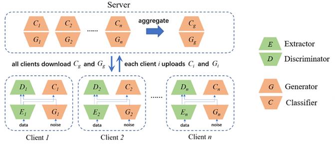
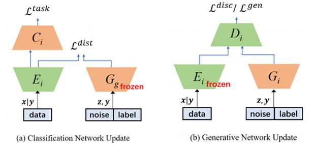
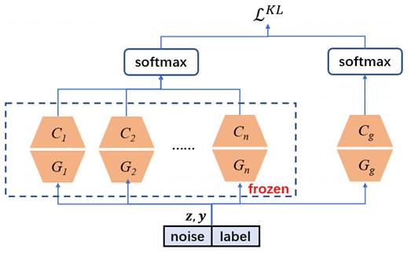
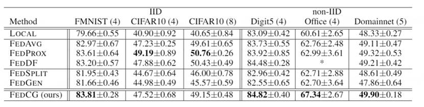
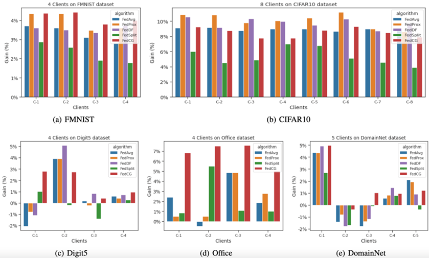
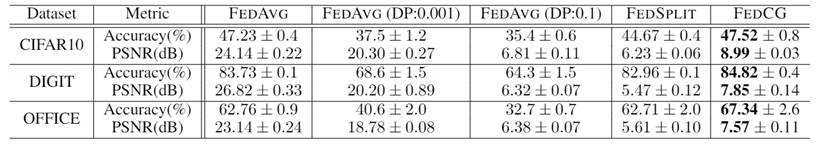

# FedCG: Leverage Conditional GAN for Protecting Privacy and Maintaining Competitive Performance in Federated Learning

## Introduction

Federated Learning (FL) aims to enable clients to collaboratively build machine learning models without sharing their private data, thereby protecting data privacy. Recent studies have demonstrated that the information exchanged during the federated learning process is susceptible to gradient-based privacy attacks. Consequently, various privacy-preserving methods have been employed to thwart such attacks and safeguard data privacy. However, these defensive approaches either introduce an order of magnitude more computational and communication overhead (e.g., homomorphic encryption) or significantly degrade model performance in terms of predictive accuracy (e.g., using differential privacy). FedCG combines Conditional Generative Adversarial Networks with segmentation learning to achieve effective privacy protection for data while maintaining competitive model performance.

More specifically, FedCG decomposes each client's local network into a private feature extractor and a public classifier, keeping the feature extractor local to protect privacy. Each client uses a generator to match the output representation of the feature extractor. The novelty of FedCG lies in its sharing of the client's generator with the server instead of the extractor, to aggregate the shared knowledge of the clients and enhance model performance (as shown in Figure 1).

<p align="center">
  
  <center>Figure 1：FedCG overview </center>
</p>


This strategy has two advantages: 

- First, compared to conventional federated learning methods where the server can obtain complete client models (such as FedAvg and FedProx), FedCG does not expose models that are directly in contact with the raw data (i.e., the extractor), thus significantly reducing the possibility of client data leakage. 
- Second, the server can aggregate the generators and classifiers from the clients using knowledge distillation (Hinton, Vinyals, and Dean 2015) without accessing any public data.

### FedCG Training Procedure

The training steps of FedCG are divided into two-phase client updates (as shown in Figure 2) and server-side aggregation (as shown in Figure 3). 

In the two-phase client updates, we first optimize the classification network (including the feature extractor and classifier) using the global generator sent from the server, and then train a local generator to fit the output representation of the feature extractor $G(z,y) \approx F(x|y)$. We use this local generator to replace the feature extractor, aggregating the knowledge from all clients on the server side while protecting data privacy.

<p align="center">
  
  <center>Figure 2：client side training procedure of FedCG.</center>
</p>


In the server-side, we aggregate a global classifier $C_g$ and a global generator $G_g$ through the method of knowledge distillation. Then, the server sends the global classifier and the global generator to each client.

<p align="center">
  
  <center>Figure 3: server side training procedure of FedCG.</center>
</p>


### Experimental Results

As shown in Table 1, overall, FedCG achieves the highest accuracy on 4 out of 6 datasets. In the IID scenario: it achieves the highest accuracy on FMNIST. In the Non-IID scenario: it achieves the best performance on 3 datasets, especially on the Office dataset, where FedCG outperforms FedProx, the second-highest accuracy, by 4.35%.

 <p align="center">
  
  <center>Table 1: Comparison of Top-1 accuracy between FedCG and baselines. Boldface indicates the best performance. An asterisk (*) denotes that no measurement results are available. The numbers in parentheses indicate the number of clients.</center>
</p>


IID Scenario: All FL methods significantly outperformed local models on all clients. On the FMNIST dataset, FedCG performed the best across all clients (see Figure 4(a)). The performance of FedCG is comparable to those FL methods that share all local models (see Figure 4(b)).

Non-IID Scenario: In all three Non-IID datasets, no FL method was able to defeat local models on every client (see Figures 4(c), 4(d), and 4(e)). FedCG achieved the best results on the greatest number of clients. It is also the algorithm that defeated local models the most frequently.

<p align="center">
  
  <center>Figure 4: In experiments across 5 datasets, FEDAVG, FEDPROX, FEDDF, FEDSPLIT, and FedCG (in red) all achieved accuracy improvements compared to LOCAL on each client. The vertical axis represents the performance difference in accuracy (%). Positive (negative) gains mean that the FL method performed better (worse) than the LOCAL model.</center>
</p>
 

As shown in Table 2, the experimental results of the privacy analysis indicate that with FedAvg, the more DP noise added, the better the privacy protection, but it leads to a significant loss in accuracy; with FedSplit, privacy can be protected, but there is a substantial loss in accuracy; with FedCG, a higher accuracy can be achieved while maintaining privacy protection.

<p align="center">
  
  <center>Table 2: Comparison of model performance and privacy protection effects between FedAVG, FedSPLIT, and FedCG.</center>
</p>

### Summary and Future Work
We have proposed FedCG, with the aim of protecting data privacy while maintaining competitive model performance. FedCG decomposes each client's local network into a private feature extractor and a public classifier, keeping the feature extractor local to protect privacy. It shares the client's generator with the server to aggregate shared knowledge, thereby enhancing the performance of the client's local classification network. Experiments have shown that FedCG has a high level of privacy protection capability and can achieve competitive model performance.

The shortcomings of this paper lie in the fact that the theoretical analysis of privacy protection for FedCG remains to be explored. Additionally, this paper uses LeNet as the local network, which is relatively small in model size. The authors will investigate deeper neural networks to further test the effectiveness of the FedCG method.

## Data

- Digit5 
https://drive.google.com/open?id=1A4RJOFj4BJkmliiEL7g9WzNIDUHLxfmm


- Office-Caltech10 
https://github.com/jindongwang/transferlearning/tree/master/data#office-caltech10

- DomainNet 
https://datasets.activeloop.ai/docs/ml/datasets/domainnet-dataset/
https://ai.bu.edu/M3SDA/#dataset


## Usage
- Train `FedAVG` `Lenet` on `FashionMNIST` dataset:
```bash
python main.py --algorithm="fedavg" --dataset="fmnist" --model="lenet5" --seed=1 --gpu=1
```
- Train `FedCG` `Lenet` on `Cifar` dataset:
```bash
python main.py --algorithm="fedcg" --dataset="cifar" --model="lenet5" --seed=1 --gpu=1
```


| Parameter                      | Description                                 |
| ----------------------------- | ---------------------------------------- |
| `algorithm` | The training algorithm. Options: `local`, `fedavg`, `fedsplit`, `fedprox`, `fedcg`. Default = `fedavg`. |
| `dataset`      | Dataset to use. Options: `fmnist`, `digit`, `office`, `cifar`. Default = `digit`. |
| `model` | The model architecture. Options: `lenet5`, `resnet18`. Default = `lenet5`. |
| `distance`  | The distance between extractor and generator. This parameter takes effect only when the algorithm is fedcg. Options: `none`, `mse`, `cos`. Default = `none`. |
| `lr` | learning rate for clients' extractor and classifier optimzer and server's generator and classifier optimizer, default = 2e-4. |
| `weight_decay` | weight decay for clients' extractor and classifier optimzer and server's generator and classifier optimizer, default = 1e-5. |
| `add_noise` | Whether adding noise to train data, default = False. |
| `batch_size` | Batch size, default = `8`. |
| `local_epoch` | Number of local training epochs, default = `20`. |
| `gan_epoch` | Number of local gan training epochs, default = `20`. |
| `global_epoch` | Number of server training epochs, default = `20`. |
| `global_iter_per_epoch` | Number of iteration per epoch for server training, default = `100`. |
| `mu` | The proximal term parameter for FedProx, default = `0.01`. |

- `model_inversion` folder contains code for model inversion attack.

## Citation

Please kindly cite our paper if you find this code useful for your research.

```
@inproceedings{ijcai2022-324,
  title     = {FedCG: Leverage Conditional GAN for Protecting Privacy and Maintaining Competitive Performance in Federated Learning},
  author    = {Wu, Yuezhou and Kang, Yan and Luo, Jiahuan and He, Yuanqin and Fan, Lixin and Pan, Rong and Yang, Qiang},
  booktitle = {Proceedings of the Thirty-First International Joint Conference on
               Artificial Intelligence, {IJCAI-22}},
  publisher = {International Joint Conferences on Artificial Intelligence Organization},
  editor    = {Lud De Raedt},
  pages     = {2334--2340},
  year      = {2022},
  month     = {7},
  note      = {Main Track}
  doi       = {10.24963/ijcai.2022/324},
  url       = {https://doi.org/10.24963/ijcai.2022/324},
}
```
